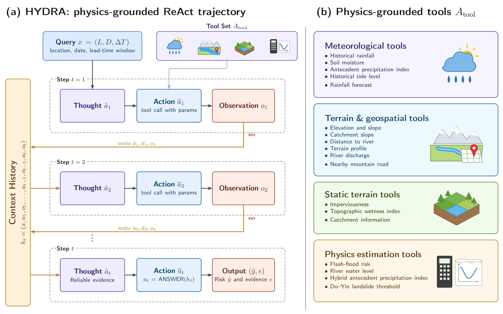

# Hydra: Dynamic Hydrological Reasoning Agents for Disaster Forecasting

Code, benchmark, execution traces, and evaluation artifacts for the PRICAI 2026 paper.

**Paper:** Hydra: Dynamic Hydrological Reasoning Agents for Disaster Forecasting (PRICAI 2026)  
**Authors:** Duy-Thanh-Long Van, Vinh-Tiep Nguyen, Tu-Anh Nguyen-Hoang, Ngan Luu-Thuy Nguyen

Hydra is a multi-hazard flood and landslide risk assessment framework in which a large
language model acts as a ReAct-style orchestrator over deterministic hydrological and
geotechnical tools. This repository contains everything required to inspect and verify the
results reported in the paper.



## Reproducibility

Hydra queries commercial LLM APIs and external environmental services whose contents change
over time. Live re-execution therefore does not reproduce our runs exactly. We release the
artifacts required to verify every number in the paper without any API access.

### 1. Recompute the reported metrics, no API keys required

`data/predictions/` contains per-event predictions for all three backbones and three lead
times, alongside the Hydra-Bench ground truth in `data/hydra_bench/`.

```bash
pip install -r requirements.txt
python src/evaluate_metrics.py
```

This recomputes precision, recall, specificity, and F1 per (backbone, lead-time) cell from the
raw per-event predictions, plus Tool Coverage Rate and M2/M3 LLM-judge scores from the released
traces and judge-score data. Pass `--check` to verify: the P/R/Specificity/F1 point estimates
fall within the paper's reported mean ± σ ranges (only one of the paper's three runs is
released per cell), while Tool Coverage Rate and M2/M3 reproduce the paper's Table 6 and
Table 7 exactly, since both come from a single canonical run / judged sample either way.

### 2. Full execution traces

`traces/raw/traces.jsonl.gz` contains the complete tool-call record for every evaluated
event: tool names, call arguments, raw tool responses, tool failures, and the agent's full
final reasoning-and-conclusion text. `traces/raw/README.md` documents the exact record schema.

### 3. Readable trace samples

`traces/highlighted/` renders a stratified sample of 30 traces as Markdown, viewable directly
in the browser. The set is stratified across hazard, backbone, and outcome, and includes
correct assessments, incorrect assessments, and runs where a tool call failed. The sampling
rule and random seed are in `traces/SELECTION.md`, so the selection is reproducible and not
curated by hand.

Start with these three:

- [`flood_gemini-3.1-flash-lite_T1_correct_d32733a1.md`](traces/highlighted/flood_gemini-3.1-flash-lite_T1_correct_d32733a1.md):
  a full successful chain, from rainfall retrieval through threshold comparison to risk level
- [`flood_ministral-3-14b_T1_incorrect_3e1037eb.md`](traces/highlighted/flood_ministral-3-14b_T1_incorrect_3e1037eb.md):
  an incorrect assessment
- [`landslide_ministral-3-14b_T1_toolfail_c0411f50.md`](traces/highlighted/landslide_ministral-3-14b_T1_toolfail_c0411f50.md):
  a tool-call failure and how the agent proceeded

### 4. Methodology, in full

- `prompts/` contains the complete system prompts for both hazards and the judge prompts used
  for M2 and M3. `prompts/README.md` states exactly what is shared across backbones and what
  is not. The actual judged results those prompts produced — not just the prompts themselves —
  are in `data/judge_scores/`.
- `docs/tools.md` documents each tool's signature, upstream data source, spatial and temporal
  resolution, and units.
- `docs/tool_failures.md` documents the failure taxonomy and how each class is handled.
- `docs/efficiency.md` reports latency, mean tool calls, and tool-failure rate per backbone
  and hazard, computed from the released traces.

### 5. Live execution (bring your own keys)

`src/` contains the orchestrator and the tool implementations. Copy `.env.example` to `.env`,
supply your own API keys, load it into your environment, then from `src/`:

```bash
cd src
python -m agent.run --lat 21.0278 --lon 105.8342 --date 2024-09-08 --lead 3 --hazard flood
```

Results will differ from ours: LLM sampling is stochastic, and the upstream environmental
services are updated over time.

`SUPABASE_URL`/`SUPABASE_KEY` and `GEE_PROJECT_ID` in `.env.example` are both optional — every
tool that can use them has a working fallback without them. See
`docs/optional_local_cache.md` if you want to set up the Supabase elevation/slope cache.

## Benchmark

Hydra-Bench covers 1,000 labelled location-date pairs per hazard for Vietnam in 2024, split
evenly between positives and negatives, with negatives comprising both cross-season (easy) and
temporal-proximity (hard) samples. `data/hydra_bench/CONSTRUCTION.md` documents the extraction
pipeline, the landslide scope criteria, and the two-tier negative sampling design.

**Source text is not redistributed.** Positives are derived from Vietnamese news reports. We
release the source URL and the extracted structured fields for each event, not the article
text.

### Known limitations of these artifacts

- Labels are news-derived and therefore subject to reporting bias toward severe and densely
  populated events. Negative labels indicate no recorded report, not verified absence.
- Rainfall over the forecast window in the released traces comes from ERA5-Land reanalysis
  used as a perfect-forecast proxy, so trace-level rainfall values are not what an operational
  forecast would have supplied at the cutoff date.
- M2 and M3 scores are LLM-judged, not expert-annotated. The judge prompts are released so
  that alternative judges or human annotation can be substituted.
- The landslide calculator (`calculate_doyin_threshold`) applies no numeric slope gate or
  regional adjustment at the calculator layer — that reasoning happens at the prompt level
  instead (see `prompts/system_prompt_landslide.md`).

## Example: live execution

Real output from running `src/agent` live with Ministral 3 14B — not one of the released
evaluation events, just a demonstration of what the command in "Live execution" above
actually produces:

### Flood assessment, event live-test

**Event** live-test | **Backbone** ministral-3-14b | **Lead** T-1  
**Ground truth** positive | **Predicted** HIGH  
**Tool calls** 9 | **Latency** 74.33s | **Tokens** 10407

---

##### Step 1

**Action.** `get_elevation_slope(lat=16.816867, lon=107.101826)`

**Observation.**
```json
{
  "elevation": 21.0,
  "slope": 0.41,
  "terrain": "plain",
  "source": "open_meteo"
}
```

---

##### Step 2

**Thought.** ### Step 1 — Terrain Classification
- **Elevation**: 21.0 meters (above sea level)
- **Slope**: 0.41 degrees (extremely flat)
- **Terrain Type**: Plain

---
##### Step 2 — Data Collection (Urban / River / Coastal Pathway)
Since the terrain is a plain, I will proceed with the **Urban / River / Coastal** pathway.

###### a. Fetching historical rainfall data for the last 24 hours leading up to the event (2024-11-02).
This will provide insights into the rainfall intensity and cumulative totals that could trigger flooding.

**Action.** `get_historical_rainfall(lat=16.816867, lon=107.101826, event_date='2024-11-02', days_before=1)`

**Observation.**
```json
{
  "total_mm": 6.4,
  "max_1h_mm": 0.9,
  "max_2h_mm": 1.3,
  "max_3h_mm": 1.7,
  "max_6h_mm": 2.9,
  "max_12h_mm": 4.7,
  "max_24h_mm": 6.4,
  "daily_breakdown": [
    {
      "date": "2024-11-01",
      "rain_mm": 0.0
    },
    {
      "date": "2024-11-02",
      "rain_mm": 6.4
    }
  ],
  "period": "2024-11-01 to 2024-11-02",
  "days": 1
}
```

---

##### Step 3

**Thought.** #### b. Fetching tide level data for the same date.
This will determine if coastal flooding is a concern due to high tide levels.

**Action.** `get_historical_tide_level(lat=16.816867, lon=107.101826, event_date='2024-11-02', elevation_m=21.0)`

**Observation.**
```json
{
  "tide_level_cm": 0.0,
  "location_type": "highlands",
  "elevation_m": 21.0,
  "note": "Location is above 10m elevation — beyond tidal reach."
}
```

---

##### Step 4

**Thought.** #### c. Fetching river discharge data for the same date.
This will assess the risk of riverine flooding due to elevated water levels.

**Action.** `get_river_discharge(lat=16.816867, lon=107.101826, event_date='2024-11-02')`

**Observation.**
```json
{
  "river_discharge_m3s": 13.59,
  "date": "2024-11-02",
  "unit": "m3/s",
  "model": "GloFAS v4.0",
  "river_scale": "small"
}
```

---

##### Step 5

**Thought.** #### d. Fetching distance to the nearest river.
This will help determine proximity to riverine flood risks.

**Action.** `get_distance_to_river(lat=16.816867, lon=107.101826)`

**Observation.**
```json
{
  "distance_m": -1,
  "error": "Overpass API error: RetryError[<Future at 0x1130cc530 state=finished raised ConnectError>]"
}
```

---

##### Step 6

**Thought.** The distance to the nearest river could not be retrieved due to an API error. I will proceed with the available data and assess the risk based on the other factors.

###### e. Fetching Antecedent Precipitation Index (API) for soil saturation assessment.
This will indicate if the soil is already saturated, which could amplify flooding.

**Action.** `get_antecedent_precipitation_index(lat=16.816867, lon=107.101826, event_date='2024-11-02', days=7)`

**Observation.**
```json
{
  "api_value": 244.45,
  "interpretation": "very_high_saturation",
  "decay_factor": 0.85,
  "period_days": 7,
  "total_rainfall_mm": 489.4,
  "daily_breakdown": [
    {
      "date": "2024-10-26",
      "rain_mm": 29.4
    },
    {
      "date": "2024-10-27",
      "rain_mm": 288.7
    },
    {
      "date": "2024-10-28",
      "rain_mm": 72.7
    },
    {
      "date": "2024-10-29",
      "rain_mm": 37.4
    },
    {
      "date": "2024-10-30",
      "rain_mm": 60.2
    },
    {
      "date": "2024-10-31",
      "rain_mm": 1.0
    },
    {
      "date": "2024-11-01",
      "rain_mm": 0.0
    }
  ]
}
```

---

##### Step 7

**Thought.** #### f. Fetching soil moisture data for the same date.
This will provide additional context on soil saturation.

**Action.** `get_soil_moisture(lat=16.816867, lon=107.101826, event_date='2024-11-02')`

**Observation.**
```json
{
  "soil_moisture_m3_per_m3": 0.365,
  "saturation": "wet",
  "date": "2024-11-02"
}
```

---

##### Step 8

**Thought.** #### g. Fetching imperviousness data for the location.
This will assess the urban runoff potential due to built-up surfaces.

**Action.** `get_imperviousness(lat=16.816867, lon=107.101826, year=2024)`

**Observation.**
```json
{
  "imperviousness_pct": 38.55,
  "alpha_modifier": 0.642,
  "epoch_used": "2020-2025",
  "source": "GHSL_GEE_P2023A",
  "method": "gee_ghsl_lookup",
  "radius_m": 500,
  "note": "Built-up fraction 38.5% from GHSL P2023A (GEE)."
}
```

---

##### Step 9

**Thought.** #### h. Fetching Topographic Wetness Index (TWI) for the location.
This will determine if the terrain naturally accumulates water.

**Action.** `get_twi(lat=16.816867, lon=107.101826)`

**Observation.**
```json
{
  "twi_value": 9.09,
  "twi_modifier": 1.003,
  "interpretation": "flat — moderate accumulation",
  "source": "MERIT_Hydro_GEE",
  "method": "gee_merit_twi_calc",
  "note": "Topographic Wetness Index calculated from MERIT Hydro (90m, Cloud)."
}
```

---

##### Final Assessment

---

##### Step 3 — Physical Risk Synthesis

###### 3A. Dominant Flood Mechanism
- **Location Type**: Highlands (not coastal, as tide level is 0.0 cm).
- **Terrain**: Plain (slope = 0.41°).
- **Rainfall**: 6.4 mm in 24 hours (low intensity).
- **River Discharge**: 13.59 m³/s (small river, elevated but not extreme).
- **Soil Saturation**: Very high (API = 244.45, soil moisture = 0.365 m³/m³).
- **Imperviousness**: 38.55% (moderate urbanization).
- **TWI**: 9.09 (flat terrain with moderate water accumulation).

**Dominant Mechanism**: **Urban Pluvial Flooding**
- The terrain is flat, and the soil is already saturated due to recent heavy rainfall (API = 244.45). Even low-intensity rainfall (6.4 mm) can overwhelm drainage systems in urbanized areas with high imperviousness and saturated soil.

---

###### 3B. Driver Analysis

| **Driver**               | **Value**                     | **Physical Interpretation**

**Risk Level: HIGH**

## Licence

Code in `src/` is released under Apache-2.0 (see `LICENSE`). Benchmark data, prompts,
documentation, and traces are released under CC BY 4.0 (see `LICENSE-DATA`). Neither covers
the underlying news articles, which remain with their publishers.

## Citation

```bibtex
@inproceedings{van2026hydra,
  title     = {Hydra: Dynamic Hydrological Reasoning Agents for Disaster Forecasting},
  author    = {Van, Duy-Thanh-Long and Nguyen, Vinh-Tiep and Nguyen-Hoang, Tu-Anh and Nguyen, Ngan Luu-Thuy},
  year      = {2026}
}
```
